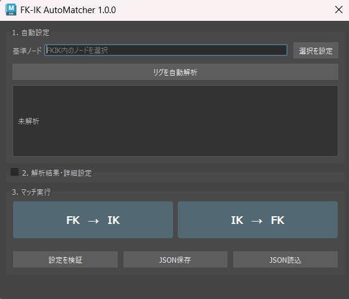

# Maya FK/IK Auto Matcher



A reusable FK/IK pose-matching tool for **Autodesk Maya 2026 / Python 3**.

FK/IK切り替え時に発生するポーズのずれを抑え、IKへの切り替えではPole Vectorも自動的に再配置するマッチングツールです。

キャラクター **Diana** 用に制作したFK/IK Match Toolをベースに、キャラクター固有の命名やリグ構造への依存を減らし、異なる3点リムでも利用できるよう再設計しました。

汎用化では単純にノード名を設定へ移すのではなく、**対象リグの解決、設定の検証、Pole Vectorのフォールバック**まで含めてワークフローを見直しています。

---

## Features

* FK → IK / IK → FKの双方向マッチング
* 3点リムに対応
* IK End Controlの位置・回転を自動調整
* Pole Vectorの自動計算・再配置
* 選択ノードを起点としたリグ構造の解決
* Rig Module Builder Manifestからのリグ情報取得
* Manifestがない場合のScene Search
* Match Settingsの確認・編集
* FK / IK Switch Valuesの編集
* 設定のJSON保存・再利用
* 直線に近いリムに対するPole Vector Fallback
* Required Node / Attributeの検証
* 解決不能なAmbiguous Candidateの検出
* Joint / ControlのNode Type検証
* 1操作を1つのMaya Undo Chunkとして処理
* Maya非依存のPole Vector計算をpytestでテスト

---

## Why I Made This

最初のFK/IK Match Toolは、Dianaの腕リグ専用として制作しました。

Diana版では対象となるJoint、Control、FKIK Switchがすべて既知だったため、

```text
Known Diana Rig
      ↓
Match Controls
      ↓
Switch FK / IK
```

というシンプルな処理で実装できます。

しかし、別のリグへ適用する場合は、

* ノード名
* Namespace
* Joint / Control構造
* FKIK Switch
* Pole Vectorの状態

などが異なります。

そこで汎用版では、マッチング処理の前に**「現在選択されているリグを解決する工程」**を追加しました。

```text
Selected Node
      ↓
Resolve Rig
      ↓
Validate Settings
      ↓
Match Controls
      ↓
Switch FK / IK
```

これにより、マッチングロジックとキャラクター固有の情報を分離しています。

---

# Workflow

ツールの基本フローは以下です。

```text
Select Rig Node
      │
      ▼
  Rig Resolver
      │
      ▼
Manifest Available?
   │           │
  YES          NO
   │           │
   ▼           ▼
Manifest     Scene
  Data       Search
   │           │
   └─────┬─────┘
         ▼
   Match Settings
         │
         ▼
      Validate
         │
         ▼
    FK ↔ IK Match
```

Diana版では直接マッチングを開始していましたが、汎用版では**Resolve → Validate → Match**の3段階に分けています。

---

# Rig Resolution

## Manifest Resolution

Rig Module Builderによって生成されたリグでは、`rigModuleBuilderManifest` に保存された情報を優先して使用します。

```text
Selected Node
      ↓
Find Manifest
      ↓
Read Explicit Rig Data
      ↓
Build Match Settings
```

名前からリグ構造を推測するのではなく、生成時に記録された情報から対象ノードを取得することで、より明示的にリグを解決できます。

### Manifest Compatibility

現在のManifest Resolutionは、Rig Module Builderが生成する `rigModuleBuilderManifest` の想定Schemaを対象としています。

実装が参照する主な情報は、ルートの `created_nodes`、`source_joints` と、`module_data` 内の `module_type`、`fk_joints`、`ik_joints`、`deform_joints`、`fk_controllers`、`pole_joint_index`、`blend_plug`、`ik_controller`、`pole_controller`、`settings_controller`、`pole_distance_multiplier` です。

Manifestに記録されたModule情報、Deform Joint、FK Controller、IK Joint、IK / Pole Controller、FKIK SwitchなどからMatch Settingsを構築します。任意形式の `rigModuleBuilderManifest` JSONを読み取る汎用Manifest Parserではありません。

Rig Module Builder側のManifest Schemaが変更された場合は、本ツール側でも互換性の確認が必要です。

---

## Scene Resolution

Manifestが存在しない場合は、選択されたノードを起点としてシーン内から候補を検索します。

```text
Selected Node
      ↓
Read Context
      ↓
Namespace / Limb Context
      ↓
Search Candidates
      ↓
Resolve
      ↓
Validate
      ↓
Match Settings
```

ResolverはNamespace、選択ノードの名前、Limbを示す名前要素、Joint階層などを利用して候補を絞り込みます。

十分な根拠から候補を決定できる場合は自動的にMatch Settingsを構築します。一方、同じ優先度の候補が複数残り、安全に対象を決定できない場合は、任意のノードを採用せずAmbiguous Resolutionとして停止します。

Scene Searchは任意形式のリグ構造を完全に理解するものではありません。自動解決結果はMatch Settings上で確認でき、必要に応じて手動で修正してからMatchを実行できます。

---

# Match Settings

Resolverによって取得したリグ情報はMatch Settingsとしてまとめます。

主に以下の情報を保持します。

- Deform Start / Mid / End Joints
- FK Start / Mid / End Controls
- IK Start / Mid / End Joints
- IK End Control
- Pole Vector Control
- FKIK Switch
- FK / IK Switch Values
- Pole Vector Distance / Offset

自動解析された設定はUI上で確認・修正できます。FK / IK Switch Valuesも変更できるため、`FK = 0 / IK = 1` 以外の値を使用するリグでも明示的に設定できます。

Match SettingsはJSONとして保存・読み込みでき、同じリグや同じ構造を持つリグで再利用できます。

```text
Auto Resolve
      ↓
Match Settings
      ↓
Check / Edit
      ↓
Save JSON
      ↓
Load / Reuse
```

JSONにはノード設定、Switch Values、Pole Vector Settingsなどが保存されます。自動解析だけに依存せず、Resolverによる自動化とユーザーによる明示的な設定を組み合わせられる構成にしています。

---

# FK → IK

FKからIKへ切り替える場合は、現在のリムのポーズを基準にIK側を合わせます。

```text
Current FK Pose
      ↓
Match IK End Control
      ↓
Calculate Pole Vector
      ↓
Move Pole Control
      ↓
Switch to IK
```

まずIK End ControlのTransformを現在のEnd Jointへ合わせます。

その後、Start / Mid / End JointからPole Vector位置を計算し、Pole Controlを移動します。

すべてのマッチングが完了した後にFKIK SwitchをIKへ変更します。

### Why Match Before Switch?

単純にFKIK Switchだけを変更すると、切り替え先のControlが現在のポーズと一致していないため、ポーズが変化する可能性があります。

```text
Switch First

FK Pose
   ↓
Switch
   ↓
Different IK Transform
   ↓
Pose Pop
```

そのため、

```text
Match First

FK Pose
   ↓
Match IK Controls
   ↓
Switch
   ↓
Maintain Pose
```

の順番で処理します。

---

# IK → FK

IKからFKへ切り替える場合は、現在のIK Chainを基準にFK Controlsを合わせます。

```text
Current IK Pose
      ↓
Match FK Start
      ↓
Match FK Mid
      ↓
Match FK End
      ↓
Switch to FK
```

Start → Mid → Endの順番で対応するFK Controlを現在のJoint Poseへ合わせます。

すべてのマッチングが完了してからFKへ切り替えます。

---

# Pole Vector Calculation

通常の状態では、3点のJoint位置から現在の曲げ方向を計算します。

```text
Start -------- Projection -------- End
                     \
                      \
                      Mid
                       ↑
                  Bend Direction
```

Mid JointをStart → Endの直線へ射影し、

```text
BendVector = Mid - Projection
```

からリムの曲げ方向を取得します。

正規化した方向をMid Jointから延長することでPole Vectorの基本位置を求めます。

```text
PolePosition =
    Mid
    + BendDirection × Distance
```

---

# Straight Limb Fallback

3点が完全、またはほぼ一直線の場合、Joint位置だけでは曲げ方向を一意に判断できません。

```text
Start -------- Mid -------- End

Bend Direction = Undefined
```

異なるリグやポーズでも使用できるよう、Pole Vector方向を決定するためのフォールバックを追加しています。

```text
Joint Geometry
      ↓
Stable Direction?
   ┌──────┴──────┐
  YES            NO
   ↓              ↓
 Use          Current Pole
Direction       Direction
                  ↓
                Valid?
             ┌────┴────┐
            YES        NO
             ↓          ↓
            Use     Preferred
                     Angle
```

## 1. Joint Geometry

まずStart / Mid / Endの位置から通常の曲げ方向を計算します。

安定した方向が取得できる場合は、その結果を使用します。

## 2. Current Pole Direction

Jointがほぼ直線の場合、現在のPole Vector Controlの位置を利用します。

既存のPoleがどちら側に配置されていたかを方向情報として利用することで、現在のリグ状態をできるだけ維持します。

## 3. Preferred Angle

Current Poleからも安定した方向を取得できない場合は、Jointの `preferredAngle` を利用してフォールバック方向を求めます。

これにより、直線に近いリムでも可能な限り予測可能なマッチングを行います。

---

# Error Handling

汎用化によって対象となるリグ構造が固定ではなくなるため、Resolve時とMatch実行前に設定を検証します。

以下のような状態を検出します。

- Required Nodeが存在しない
- Resolverが候補を安全に一意決定できない
- Jointとして必要なNodeのTypeが一致しない
- Controlとして必要なNodeがTransformではない
- Match Settingsが不完全
- FKIK Switch Attributeが存在しない
- FKIK Switchへ書き込めない
- Pole Vector方向を安全に決定できない

安全に処理を続行できない場合は、Scene変更を開始せずエラーとして停止します。Ambiguous Resolutionの場合は、候補Nodeも表示します。Resolveできない場合も、Match Settingsを手動で設定できます。

また、1回のマッチング処理は1つのMaya Undo Chunkとして実行します。

---

# Architecture

汎用版では、Diana固有の実装から発展させる際に責務を分離しました。

```text
        UI
        │
        ▼
     Resolver
        │
        ▼
   Match Settings
        │
        ▼
      Matcher
        │
        ▼
   Math / Maya API
```

### UI

ユーザー操作、設定表示、Match実行を担当します。

### Resolver

選択されたノードやManifestから対象リグを解決します。

### Match Settings

ResolverとMatcherの間で、マッチングに必要なリグ情報を保持します。

### Matcher

解決済みのリグ情報を使用してFK → IK / IK → FK処理を実行します。

### Math

Pole Vectorなどの数学処理を担当します。

Maya Sceneへ直接依存しない計算を分離することで、Mayaを起動せずpytestから検証できるようにしています。

---

# From Diana-specific to General-purpose

汎用版は、Diana版のノード名だけを変更したものではありません。

```text
Diana-specific FK/IK Matcher
             │
             ▼
 Separate Rig-specific Data
             │
             ▼
       Rig Resolver
             │
             ▼
    Editable Settings
             │
             ▼
 Pole Vector Fallback
             │
             ▼
General-purpose FK/IK Auto Matcher
```

|                 | Diana Version              | General-purpose                           |
| --------------- | -------------------------- | ----------------------------------------- |
| Target          | Diana Arm                  | 3-point Limb                              |
| Rig Structure   | Known                      | Resolved                                  |
| Node Resolution | Fixed                      | Resolver                                  |
| Manifest        | Not Required               | Supported                                 |
| Settings        | Diana-specific             | Editable / JSON                           |
| Straight Limb   | Stop                       | Fallback                                  |
| Pole Direction  | Joint Geometry             | Geometry / Current Pole / Preferred Angle |
| Goal            | Predictable Diana Workflow | Reusability                               |

Diana版では、対象リグが既知であることを利用し、**シンプルで予測可能な処理**を優先しました。

汎用版では対象リグが未知であることを前提として、

**「どのリグを操作するかを解決する」
→「安全に操作できるか検証する」
→「マッチングする」**

というワークフローへ変更しています。

---

# Installation

RepositoryをCloneまたはDownloadし、Repository RootをMayaから参照できる状態にします。

```text
FK-IK-AutoMatcher/
├─ fk_ik_auto_matcher/
├─ launch_fk_ik_auto_matcher.py
├─ reload_fk_ik_auto_matcher.py
└─ ...
```

MayaのPython Script Editorからは、以下のように起動できます。

```python
import sys
project_root = r"C:\path\to\FK-IK-AutoMatcher"

if project_root not in sys.path:
    sys.path.insert(0, project_root)

from fk_ik_auto_matcher import show

window = show()
```

`project_root` には、`fk_ik_auto_matcher` Packageが含まれているRepository Rootを指定します。

Repositoryに含まれる `launch_fk_ik_auto_matcher.py` は、Repository RootをPython Pathへ追加して `fk_ik_auto_matcher.show()` を実行するランチャーです。

開発中にPackageを再読み込みする場合は `reload_fk_ik_auto_matcher.py` を使用できます。このScriptは読み込み済みのPackage Moduleをクリアし、再ImportしてUIを開き直します。

本ツールはAutodesk Maya上での実行を前提としています。

---

# Development

本ツールはAutodesk Maya 2026のPython環境をRuntimeとして使用します。

Maya Sceneに依存しないMatch Settings、Resolverの補助ロジック、Pole Vector計算などは、通常のPython環境からUnit Testできます。pytestは別途インストールしてください。

```shell
python -m pip install pytest
python -m pytest
```

テストはRepository Rootから実行します。

Maya Scene、Control Transform、Joint Type、FKIK Switch、Undo ChunkなどMaya APIへ依存するIntegration部分については、Autodesk Maya 2026上で確認します。

PySide6、`maya.cmds`、`maya.OpenMayaUI`、shiboken6などのMaya固有RuntimeはMaya同梱環境を前提としており、通常の外部Python環境だけでUIを起動することは想定していません。

---

# Limitations

- 現在は3点リムを対象としています
- Scene Searchは名前、Namespace、選択Context、Joint階層などを利用するヒューリスティックなResolverです
- FK Control / IK Jointの3点選択には名前順も利用するため、独自性の高い命名やリグ構造では自動解決できない場合があります
- 自動解決できない場合はMatch Settingsを手動で設定し、JSONとして再利用できます
- Locked Channelや特殊なConstraint / Offset構造では追加対応が必要になる場合があります
- Controlが要求されたTransformを受け取れることを前提としています
- Manifest Resolutionは対応するRig Module BuilderのManifest Schemaを前提としています
- Maya Scene Fileは誤公開防止のためRepositoryでは除外しています

---

# Environment

- Autodesk Maya 2026
- Python 3.11
- Maya Python API
- PySide6
- shiboken6
- pytest（Maya非依存ロジックの開発テスト用）

---

# License

MIT License

© 2026 Yuzuki Midoshima
