# Maya FK/IK Auto Matcher


Autodesk Maya向けの **FK / IKポーズ合わせツール**です。


FK / IK切り替え時に発生するポーズのずれを抑え、FK → IKでは手先・足先のIKコントローラーだけでなく、**Pole Vectorも自動で再配置**します。


オリジナルキャラクター **Diana** 用に専用ツールを制作したことをきっかけに「この機能を他のリグでも使えるようにできないか」と考え、汎用化に挑戦しました。

キャラクター固有のノード名やリグ構造への依存を減らし**異なる3点リムでも利用できる構成**にしています。

---

## Demo

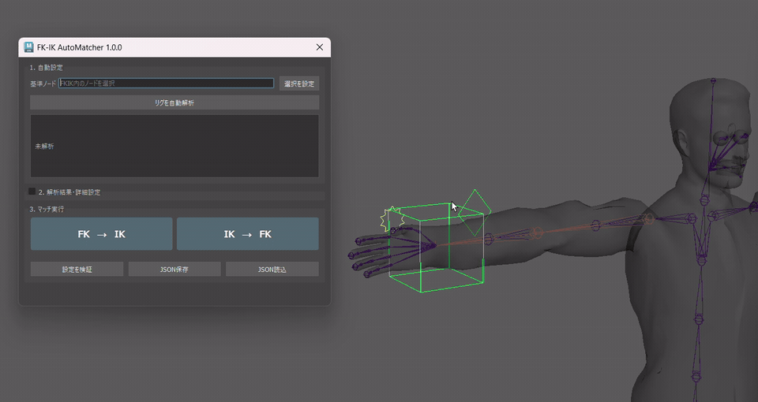

リグに関連するコントローラーを選択すると、  
FK / IKの切り替えに必要なコントローラーやジョイントを自動で検索・取得します。

取得した情報をもとに、現在のポーズへ切り替え先を合わせてから  
FK / IKを切り替えることで、ポーズのずれを抑えます。

### FK → IK

現在のFKポーズに手先・足先のIKコントローラーを合わせ、  
腕・脚の曲がる方向からPole Vectorの位置を計算・再配置してからIKへ切り替えます。

### IK → FK

現在のIKポーズに各FKコントローラーの回転を合わせてから、  
ポーズを維持した状態でFKへ切り替えます。

---

# 主な機能

- **FK → IK / IK → FKの双方向ポーズ合わせ**
- **3点リムに対応**
- 手先・足先のIKコントローラーの位置・回転を自動調整
- Pole Vectorの自動計算・再配置
- 選択したノードから関連するリグ構造を自動解析
- Manifestを利用したリグ情報の取得
- Manifestがない場合はシーン内から関連ノードを検索
- Match Settingsから解析結果を確認・手動編集
- FK / IKの切り替え値を変更可能
- 設定をJSONとして保存・再利用
- 直線に近いリムに対するPole Vectorの代替処理
- 必要なノード・アトリビュートの実行前チェック
- 対象を安全に特定できない場合は処理を停止
- ジョイント・コントローラーの種類を確認
- 1回のポーズ合わせを1回のMaya Undoとして処理

---

# 制作背景

最初のFK / IKポーズ合わせツールは、  オリジナルキャラクター **Dianaの腕リグ専用ツール**として制作しました。

[Diana-Portforio](https://github.com/Yuzuki-Midoshima/Diana-Character-Rig)


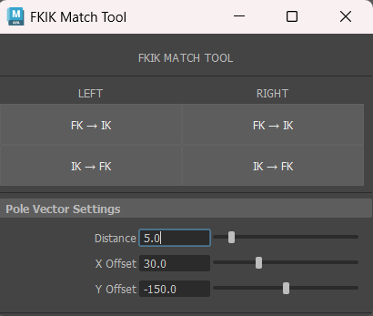

Diana版では、対象となるジョイントやコントローラー、  FK / IK切り替え用のアトリビュートがすべて既知だったため、  固定されたリグ構造を利用してポーズを合わせることができました。

```text
Diana Rig
    ↓
ポーズを合わせる
    ↓
FK / IKを切り替える
```

しかし、別のキャラクターやリグへ適用する場合は、

- ノード名
- Namespace
- ジョイント / コントローラー構造
- FK / IK切り替え用アトリビュート
- Pole Vectorの状態

などが異なります。

そこで、Diana専用ツールで使用していたポーズ合わせ処理をベースに、  
**「この機能を別のリグでも使えるようにできないか」**と考え、汎用化しました。


汎用版では、単純にノード名を変更するのではなく、

```text
関連するノードを選択
        ↓
リグ構造を解析
        ↓
設定を確認
        ↓
FK / IKのポーズ合わせ
```

という工程を追加しています。

**リグを解析する → 安全に操作できるか確認する → ポーズを合わせる**

というワークフローにすることで、  
キャラクター固有の情報とポーズ合わせ処理を分離しています。

---

# リグの自動解析

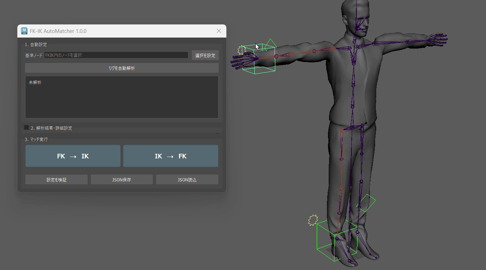

使用したいリグに関連するコントローラーやジョイントを選択すると、  
FK / IKのポーズ合わせに必要な情報を自動で検索します。

取得した情報は **Match Settings** に表示され、  
実行前に内容を確認・修正できます。

```text
関連するノードを選択
        │
        ▼
    リグを解析
        │
        ▼
Manifestがある？
   │           │
  YES          NO
   │           │
   ▼           ▼
Manifest    シーン内から
から取得       検索
   │           │
   └─────┬─────┘
         ▼
   Match Settings
         │
         ▼
     設定を確認
         │
         ▼
   FK / IKポーズ合わせ
```

リグの解析には、

- **Manifestを利用した解析**
- **シーン内検索による解析**

の2つの方法を使用します。

---

## 接続関係からの解析

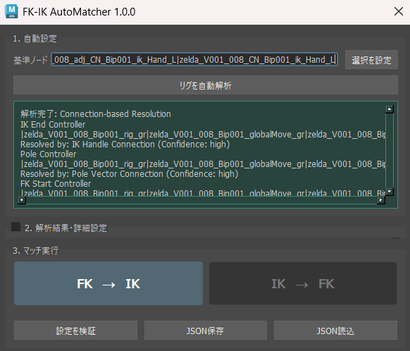

外部リグでは、コントローラーやジョイントの命名規則が
キャラクターごとに異なる場合があります。

そのため、ノード名だけで判断するのではなく、
**Maya上で実際につながっているノードの関係も利用してリグを解析**します。

例えば、

- IK Handleと接続されている手先・足先のIKコントローラー
- Pole Vector ConstraintにつながっているPole Vectorコントローラー
- Constraintを介してジョイントを動かしているFKコントローラー
- FK / IK切り替えに影響しているアトリビュート

などを接続関係から取得します。

```text
選択したコントローラー
        ↓
関連する接続をたどる
        ↓
IK Handle / Constraint / Attribute
        ↓
FK / IKに必要なノードを特定
        ↓
Match Settingsへ反映

## Manifestを利用した解析

対応するRig Module Builderで生成されたリグでは、  
Manifestに保存された情報を優先して使用します。

```text
関連するノードを選択
        ↓
Manifestを検索
        ↓
リグ情報を取得
        ↓
Match Settingsを作成
```

Manifestに記録された、

- 変形用ジョイント
- FKジョイント / コントローラー
- IKジョイント
- 手先・足先のIKコントローラー
- Pole Vectorコントローラー
- FK / IK切り替え用アトリビュート

などの情報からMatch Settingsを構築します。

ノード名だけから推測するのではなく、  
**リグ生成時に記録された情報を利用して対象を取得**します。

> Manifestを利用した解析は、対応するRig Module BuilderのManifest形式を前提としています。

---

## シーン内検索による解析

Manifestが存在しないリグでは、  
選択されたノードを起点としてシーン内から関連する候補を検索します。

主に、

- Namespace
- 選択したノードの名前
- Left / Right
- Arm / Legなどの部位情報
- ジョイント階層

などを利用して対象を絞り込みます。

対象を安全に1つへ絞り込めない主要項目では、  
候補を無理に決定せず **処理を停止**します。

シーン内検索は、あらゆる形式のリグ構造を完全に解析するものではありません。

自動解析できない場合は、  
Match Settingsから対象を手動で設定できます。

---

# Match Settings

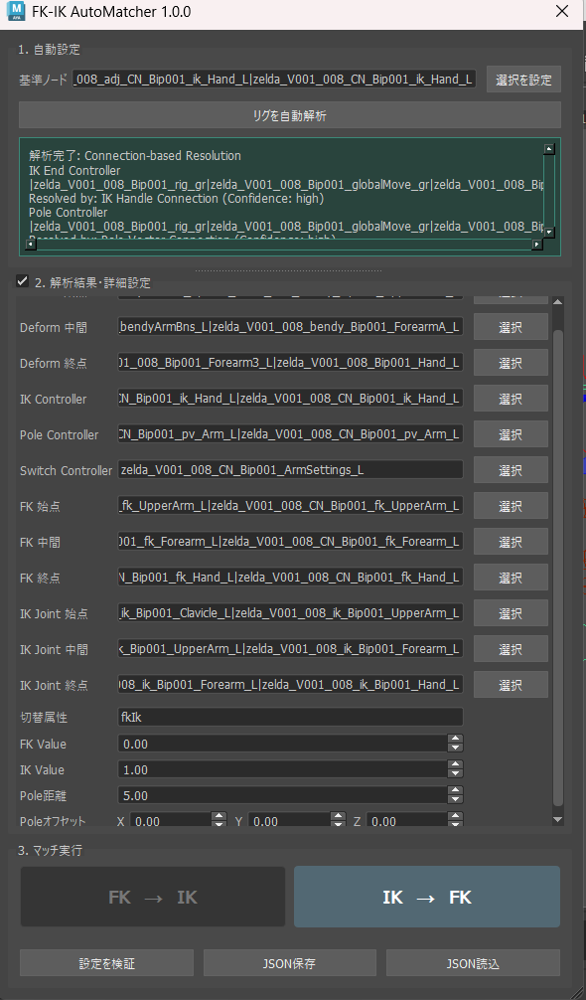

自動解析によって取得した情報は、  
**Match Settings**から確認・修正できます。

主に以下の情報を扱います。

- 変形用の始点 / 中間 / 終点ジョイント
- FKの始点 / 中間 / 終点コントローラー
- IKの始点 / 中間 / 終点ジョイント
- 手先・足先のIKコントローラー
- Pole Vectorコントローラー
- FK / IK切り替え用アトリビュート
- FK / IKの切り替え値
- Pole Vectorの距離・オフセット

自動解析された結果をそのまま使用するだけでなく、  
必要に応じて対象ノードを手動で変更できます。

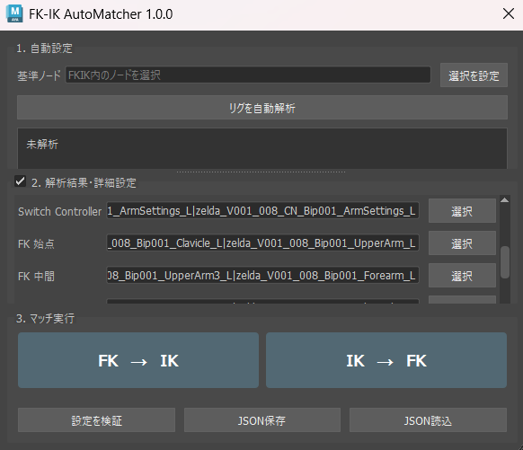

自動解析が難しいリグでも、  
必要なノードを手動で指定して使用できます。

---

## 設定の保存・再利用

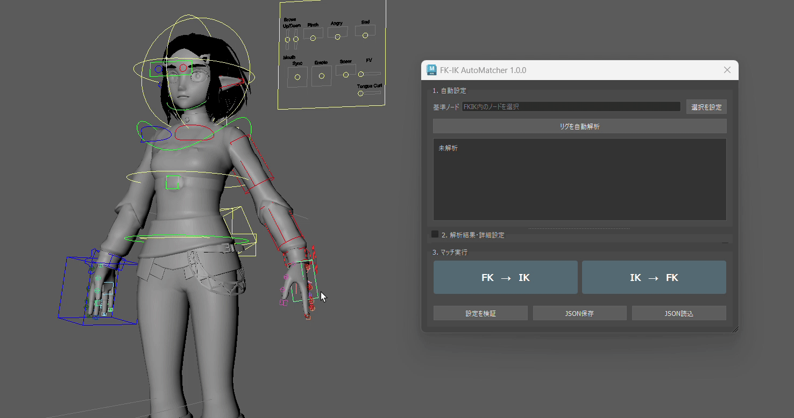

Match Settingsは **JSONとして保存・読み込み**できます。

```text
自動解析
   ↓
Match Settings
   ↓
確認・修正
   ↓
JSON保存
   ↓
読み込み・再利用
```

自動解析が難しいリグでも、一度設定を作成して保存することで、  
同じリグや同じ構造を持つリグで設定を再利用できます。

また、FK / IKの切り替え値も変更できるため、  
`FK = 0 / IK = 1` 以外の設定を持つリグにも対応できます。

**自動解析だけに依存せず、手動設定と組み合わせられる構成**にしています。

---

# FK → IK

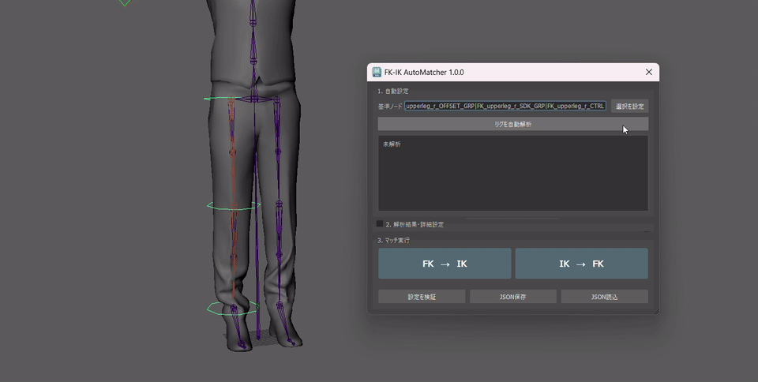

FKからIKへ切り替える場合は、  
現在のFKポーズを基準にIK側を合わせます。

```text
現在のFKポーズ
      ↓
手先・足先のIKコントローラーを合わせる
      ↓
Pole Vectorを計算
      ↓
Pole Vectorを再配置
      ↓
IKへ切り替え
```

まず、手先・足先のIKコントローラーの位置・回転を  
現在の終点ジョイントへ合わせます。

その後、腕・脚の状態からPole Vectorの位置を計算・再配置し、  
すべてのポーズ合わせが完了してからIKへ切り替えます。

単純にFK / IKの切り替え値だけを変更するのではなく、

**切り替え先を現在のポーズへ合わせる → FK / IKを切り替える**

という順番で処理することで、  
切り替え時のポーズのずれを抑えています。

---

# IK → FK

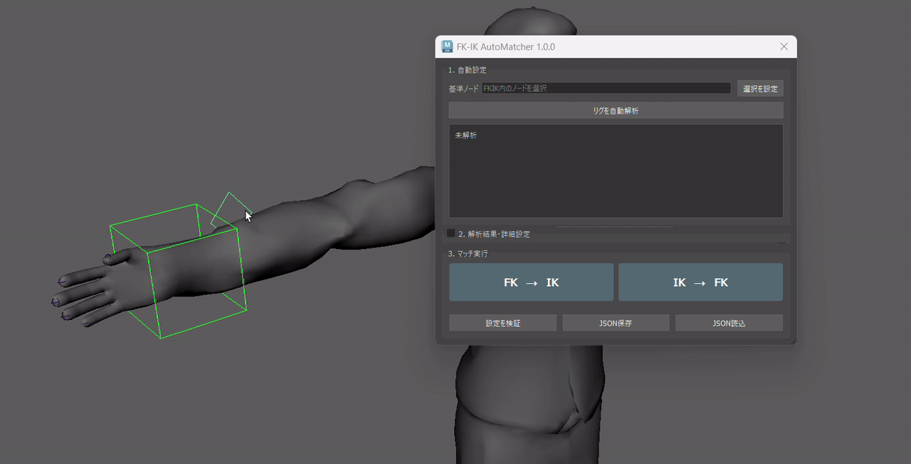

IKからFKへ切り替える場合は、  
現在のIKポーズを基準にFK側を合わせます。

```text
現在のIKポーズ
      ↓
始点のFKコントローラーを合わせる
      ↓
中間のFKコントローラーを合わせる
      ↓
終点のFKコントローラーを合わせる
      ↓
FKへ切り替え
```

始点 → 中間 → 終点の順番で、  
各FKコントローラーの回転を現在のジョイントへ合わせます。

すべてのポーズ合わせが完了してからFKへ切り替えることで、  
現在のポーズを維持した状態で切り替えます。

---

# Pole Vectorの自動配置


FK → IKでは、  
現在の腕・脚の曲がる方向に合わせてPole Vectorを自動配置します。

これにより、IKへ切り替えるたびに  
Pole Vectorを手動で合わせ直す操作を減らしています。

## 計算方法

始点 / 中間 / 終点の3つのジョイントから、  
現在のリムの曲げ方向を計算します。

```text
始点 -------- 射影位置 -------- 終点
                   \
                    \
                   中間
                     ↑
                   曲げ方向
```

中間ジョイントを始点 → 終点の直線へ射影し、  
中間ジョイントと射影位置の差から曲げ方向を取得します。

```text
曲げ方向 = 中間ジョイント - 射影位置
```

その方向を中間ジョイントから延長することで、  
Pole Vectorの基本位置を求めます。

また、現在のPole Vector位置も考慮し、  
切り替え時にPole Vectorが意図しない反対側へ配置されにくいようにしています。

---

# 直線に近いポーズへの対応


腕や脚が完全、またはほぼ一直線になると、  
ジョイントの位置だけでは曲がる方向を安定して判断できません。

```text
始点 -------- 中間 -------- 終点

曲げ方向を判断しにくい
```

そのため、以下の順番で利用できる情報を確認します。

1. **ジョイントから求めた曲げ方向**
2. **現在のPole Vectorの方向**
3. **ジョイントの `preferredAngle`**

通常はジョイントの位置から曲げ方向を取得します。

安定した方向を取得できない場合は、  
現在のPole Vectorが配置されている方向を利用します。

それでも方向を取得できない場合は、  
ジョイントの `preferredAngle` などから代わりの方向を求めます。

これにより、腕や脚が直線に近い状態でも、  
Pole Vectorが意図しない方向へ移動しにくい構成にしています。

---

# 誤操作を防ぐチェック

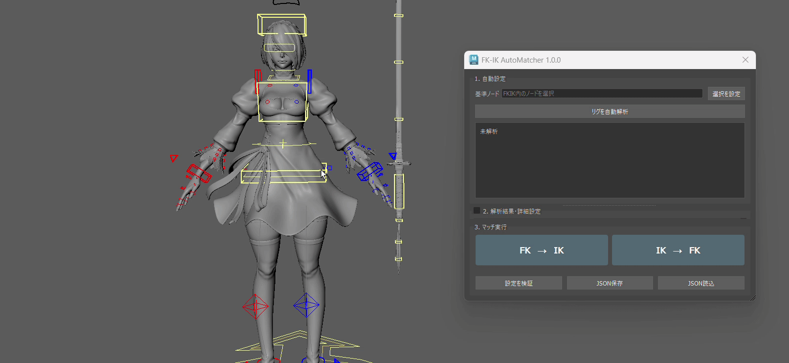

異なるリグを安全に扱うため、  
ポーズ合わせを実行する前に必要な設定を確認します。

主に以下の状態をチェックします。

- 必要なノードが存在するか
- 必要なジョイントが正しく設定されているか
- コントローラーとして使用できるノードか
- Match Settingsに必要な情報が揃っているか
- FK / IK切り替え用のアトリビュートが存在するか
- 切り替え値を書き込める状態か
- 対象となるリグを安全に特定できるか
- Pole Vectorの方向を計算できるか

問題を検出した場合は、  
**シーンを変更する前に処理を停止**します。

自動解析できない場合は、  
Match Settingsから対象ノードを手動で設定できます。

---

## Undo

1回のFK / IKポーズ合わせを、  
**1回のMaya Undo**として処理します。

そのため、通常のUndo操作で  
ポーズ合わせを実行する前の状態へ戻せます。

---

# Diana専用版から汎用版へ

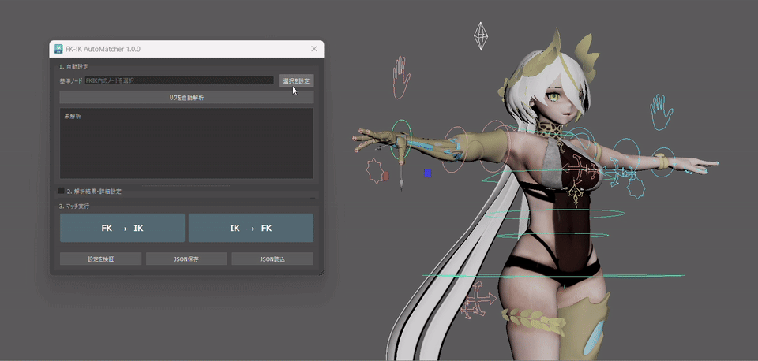

汎用版は、Diana版のノード名だけを変更したものではありません。

```text
Diana専用
FK / IKポーズ合わせ
        │
        ▼
キャラクター固有情報を分離
        │
        ▼
    リグの自動解析
        │
        ▼
  設定の確認・編集
        │
        ▼
Pole Vectorの代替処理
        │
        ▼
汎用FK / IK Auto Matcher
```

| | Diana専用版 | 汎用版 |
|---|---|---|
| 対象 | Dianaの腕 | 3点リム |
| リグ構造 | 固定 | 自動解析 |
| ノード取得 | 固定 | Manifest / シーン内検索 |
| 設定 | Diana固有 | UIから確認・編集 |
| 設定保存 | 固定 | JSON保存・再利用 |
| 直線に近いリム | 制限あり | 代替処理あり |
| Pole Vector方向 | ジョイントから計算 | ジョイント / 現在のPole Vector / preferredAngle |

Diana版では、対象リグが既知であることを利用して  
シンプルで予測可能なポーズ合わせを行っていました。

汎用版では対象リグが未知であることを前提として、

**解析する → 確認する → ポーズを合わせる**

というワークフローへ発展させています。

---

## 異なるリグ構造への対応

特定のリグだけでなく、構造や命名規則の異なるリグでも使用できるよう、
実際のリグを使いながら自動解析とポーズ合わせの処理を調整しました。

### 接続関係を利用したリグ解析

ノード名だけに依存せず、Maya上の実際の接続関係から
FK / IKに必要なノードを解析します。

主に、

- IK Handle
- Constraint
- Pole Vector Constraint
- FK ControllerとJointの接続
- FK / IK切り替えに関係するAttribute
- Joint階層

などを利用して、関連するController / Jointを取得します。

これにより、命名規則が異なるリグでも
実際のリグ構造をもとに解析できるようにしています。


### Limb範囲の判定

腕のJoint階層を単純に末端まで検索すると、
Wristより先のPalmやFinger Jointまで候補に含まれる場合がありました。

そこで、IK Handleが実際に制御している範囲や
Constraintの接続関係を利用してLimbの範囲を判定します。

```text
Shoulder
   ↓
Elbow
   ↓
Wrist       ← FK / IK Match対象
   ↓
Palm
 ├─ Thumb
 ├─ Index
 ├─ Middle
 ├─ Ring
 └─ Pinky   ← 対象外

# ツール構成

汎用化にあわせて、処理ごとの役割を分離しています。

```text
       UI
       │
       ▼
   リグ解析
       │
       ▼
 Match Settings
       │
       ▼
  ポーズ合わせ
       │
       ▼
計算処理 / Maya API
```


---

# Test

Mayaのシーンへ直接依存しない処理については、  
**pytestによるUnit Test**を用意しています。

現在の実装では **32 tests** を実行しています。

主に、

- Match Settings
- リグ解析の補助処理
- Pole Vectorの計算
- 直線に近いリムへの代替処理
- 設定値の処理

などを検証しています。

```shell
python -m pip install pytest
python -m pytest
```

Mayaのシーン操作、コントローラーのTransform、ジョイントの種類、  
FK / IK切り替え、UndoなどMaya APIへ依存する処理については、  
Autodesk Maya 2026上で確認します。

---

# インストール・起動方法

リポジトリをクローンまたはダウンロードし、  
Mayaから参照できる場所に配置します。

```text
FK-IK-AutoMatcher/
├─ fk_ik_auto_matcher/
├─ launch_fk_ik_auto_matcher.py
├─ reload_fk_ik_auto_matcher.py
└─ ...
```

MayaのPythonスクリプトエディタから、以下のコードで起動できます。

```python
import sys

project_root = r"C:\path\to\FK-IK-AutoMatcher"

if project_root not in sys.path:
    sys.path.insert(0, project_root)

from fk_ik_auto_matcher import show

window = show()
```

`project_root`には、  
`fk_ik_auto_matcher`フォルダが含まれているリポジトリの場所を指定します。

リポジトリに含まれる`launch_fk_ik_auto_matcher.py`を使用すると、  
必要なパスの設定とツールの起動をまとめて行えます。

開発中にツールを再読み込みする場合は、  
`reload_fk_ik_auto_matcher.py`を使用できます。

本ツールは**Autodesk Maya上での実行**を前提としています。
---
# 制限事項

- 現在は**3点リム**を対象としています
- シーン内検索では、名前空間・ノード名・部位情報・ジョイント階層・接続関係などから対象を解析します
- 独自性の高い命名規則やリグ構造では、自動解析できない場合があります
- 自動解析できない場合は「マッチ設定」から手動で設定し、JSONとして保存・再利用できます
- IK → FKでは、現在のIKポーズに合わせてFKコントローラーの回転を調整します
- チャンネルのロックや特殊なコンストレイント・オフセット構造によっては、追加の対応が必要になる場合があります
- コントローラーがポーズ合わせに必要な移動・回転を受け取れることを前提としています
- 構成情報を利用した解析は、対応するRig Module Builderの構成情報形式を前提としています
- Mayaシーンファイルは、データの誤公開を防ぐためリポジトリには含めていません

---

# 開発環境

- Autodesk Maya 2026
- Python 3.11
- Maya Python API
- PySide6
- shiboken6
- pytest

---

# License

MIT License

© 2026 Yuzuki Midoshima